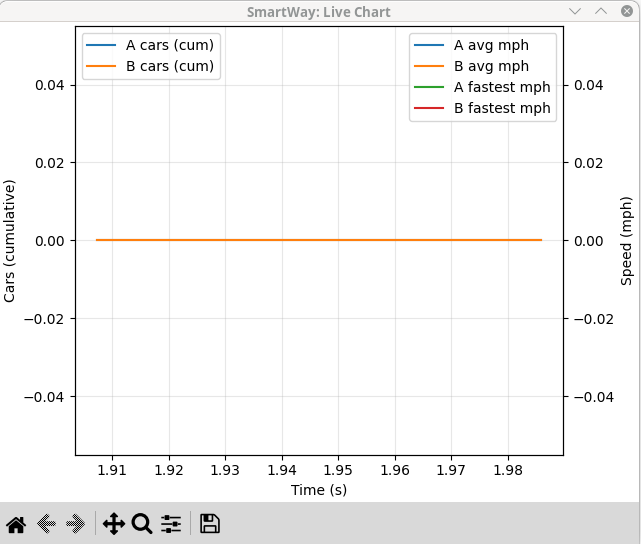
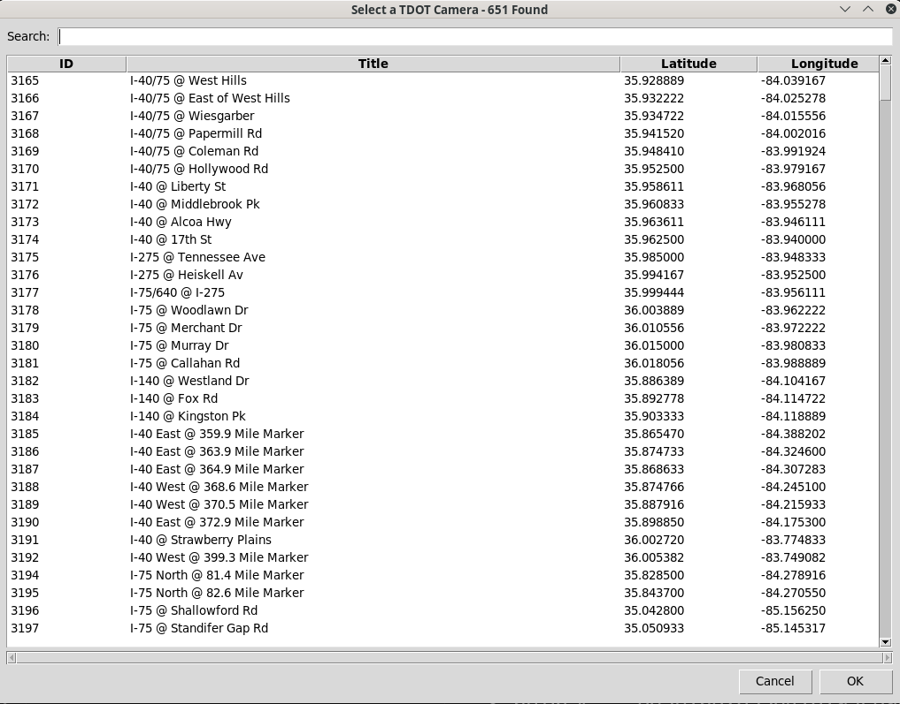
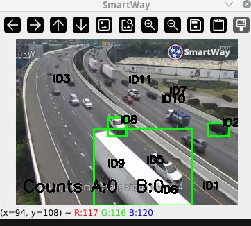

# TDOT SmartWay – Nearby Camera Counting & Real-Time Speed Charting

[](#license)
**Author:** Rob Lee • **Encoding:** UTF-8 • **Last Updated:** 2025-08-12

## Purpose

This project is an **educational and exploratory** tool demonstrating how to:

* Discover the **TDOT OpenData** API key from SmartWay’s public config,
* Locate and select **nearby traffic cameras**,
* Perform **lightweight vehicle counting** using background subtraction + centroid tracking,
* Draw **direction lines** to count A/B flows, optionally **calibrate** pixels→feet,
* Render **real-time charts** for cumulative counts, running averages, and fastest speeds.

It is **not** intended for safety-critical use. Accuracy depends on scene quality, camera angle, occlusion, lighting, and calibration.

---

## Features

* Auto-discovers TDOT `apiBaseUrl` and `apiKey` from `config.prod.json`.
* Caches an **OpenData** API key locally in `.smartway_api_key.txt` (never the Google Maps key).
* Finds **nearest cameras** using Haversine distance.
* Opens common streams (HLS/MJPEG/RTSP) via OpenCV (FFmpeg recommended).
* **Two direction lines** (A, B) for crossing counts.
* **Two-point** calibration (pixels ↔ feet) to estimate **mph**.
* **Live chart** (Matplotlib): running avg A/B, cumulative counts A/B, fastest A/B.
* Robust HTTP session with retries for flaky endpoints.

**Example – Live chart window:**


---

## Requirements & Standards

* **Python:** 3.9–3.12 (PEP 8 style; type hints; UTF-8; ISO 8601 dates in docs)
* **OS:** Windows 10/11, macOS 12+, or Linux (x86\_64/ARM64)
* **Libraries:** `opencv-python`, `matplotlib`, `numpy`, `pandas`, `requests`
* **FFmpeg:** Required for many streaming formats with OpenCV
* **Licensing:** MIT; follow local traffic data terms of use
* **Data handling:** Do not publish or hard-code private API keys

---

## Quick Start

### 1) Create and activate a virtual environment

> Use **one** of the following based on your platform/shell.

**Windows (PowerShell):**

```powershell
python -m venv .venv
.venv\Scripts\Activate.ps1
python -m pip install --upgrade pip
```

**Windows (cmd.exe):**

```bat
python -m venv .venv
.venv\Scripts\activate.bat
python -m pip install --upgrade pip
```

**macOS/Linux (bash/zsh):**

```bash
python3 -m venv .venv
source .venv/bin/activate
python -m pip install --upgrade pip
```

### 2) Install dependencies

```bash
pip install -r requirements.txt
```

If you don’t have a `requirements.txt` yet, you can install directly:

```bash
pip install opencv-python matplotlib numpy pandas requests
```

### 2a) GUI backend for charts — **Method A: TkAgg via tkinter (recommended)**

Matplotlib’s interactive chart window uses a GUI toolkit. With **Method A**, we use **TkAgg**, which requires **tkinter**.

* **Windows (python.org Python):** tkinter is typically included. If you installed Python via the **Microsoft Store**, tkinter may be missing — reinstall from python.org.
* **Windows (if missing):**

  * Add/repair Python installation and ensure **tcl/tk** feature is enabled.
* **Ubuntu/Debian:**

  ```bash
  sudo apt-get update
  sudo apt-get install -y python3-tk
  ```
* **Fedora/RHEL/CentOS:**

  ```bash
  sudo dnf install -y python3-tkinter
  ```
* **openSUSE:**

  ```bash
  sudo zypper install -y python3-tk
  ```
* **Arch Linux:**

  ```bash
  sudo pacman -S tk
  ```

**Verify tkinter works:**

```bash
python -c "import tkinter; print('tk ok')"
```

---

### 3) Install FFmpeg

OpenCV relies on FFmpeg for most network streams. Install from your OS package manager or official builds.

* **Windows:** Download FFmpeg build and add its `bin` to **PATH**. Verify:

  ```powershell
  ffmpeg -version
  ```
* **macOS (Homebrew):**

  ```bash
  brew install ffmpeg
  ```
* **Ubuntu/Debian:**

  ```bash
  sudo apt-get update && sudo apt-get install -y ffmpeg
  ```
* **Fedora/RHEL:**

  ```bash
  sudo dnf install -y ffmpeg
  ```

---

## Configuration

The script attempts to **auto-discover** the TDOT OpenData key from:

1. `SMARTWAY_API_KEY` **environment variable** (preferred override; must not start with `AIza`),
2. Local cache file `.smartway_api_key.txt`,
3. SmartWay `https://smartway.tn.gov/config/config.prod.json` (authoritative source).

Cache only stores a TDOT **OpenData** key (never the Google Maps key).

Optionally set an env var:

```bash
# macOS/Linux
export SMARTWAY_API_KEY=xxxxxxxxxxxxxxxxxxxxxxxxxxxxxxxx

# Windows (PowerShell)
$env:SMARTWAY_API_KEY = "xxxxxxxxxxxxxxxxxxxxxxxxxxxxxxxx"
```

---

## How to Run

From your activated venv:

### Basic

```bash
python smartway_counter.py
```

This uses default coordinates near downtown Nashville (36.1602364, -86.7619816) and a 5-mile search radius.

### Common options

```bash
python smartway_counter.py --lat 36.1627 --lon -86.7816 --radius 7.5 --auto
python smartway_counter.py --camera-id 12345
python smartway_counter.py --chart-interval 0.25 --display-scale 0.9
python smartway_counter.py --api-key YOUR_TDOT_OPENDATA_KEY
python smartway_counter.py --debug-key
```

### Interactive camera selection (when no `--lat/--lon`)

If you start without `--lat` and `--lon` (and no `--camera-id`), a pop-up selector lets you **search, sort, and filter** the camera list. Click a row to use that camera’s coordinates and continue.



**Controls (while the video window is focused):**

* `d` – define direction lines (click 2 points for **A**; press `d` again and click 2 for **B**)
* `k` – calibrate (click 2 points spanning known distance, then enter **feet**)
* `q` – quit

**Example – Video window with detections and overlay:**


---

## Command-Line Reference

```
--lat FLOAT            Latitude (default 36.1602364)
--lon FLOAT            Longitude (default -86.7619816)
--radius FLOAT         Camera search radius in miles (default 5.0)
--camera-id STR        Use a specific camera id (bypass nearest selection)
--auto                 Auto-select nearest camera without prompt
--api-key STR          TDOT OpenData apiKey (else discover & cache)
--debug-key            Print verbose logs for apiKey discovery
--chart-interval FLOAT Seconds between chart updates (default 0.25)
--display-scale FLOAT  Scale factor for video window (e.g., 0.75 or 1.5)
```

---

## Files & Structure

```
.
├── smartway_count.py           # Main script (this project)
├── .smartway_api_key.txt       # Local cache of TDOT OpenData key (optional)
├── requirements.txt            # Python dependencies (recommended)
└── README.md                   # You are here
```

Suggested `requirements.txt`:

```
opencv-python
matplotlib
numpy
pandas
requests
```

---

## How It Works (High Level)

```mermaid
flowchart TD
    A[Load SmartWay config.prod.json] -->|apiBaseUrl, apiKey| B(Session with retries)
    B --> C[Fetch RoadwayCameras]
    C --> D[Filter/normalize cameras]
    D --> E[Nearest cameras by Haversine]
    E --> F[OpenCV video stream]
    F --> G[Background subtractor + morphology]
    G --> H[Centroid tracker + histories]
    H --> I[Crossing detection vs lines A/B]
    I --> J[Estimate mph (optional calibration)]
    I --> K[Counts A/B (cumulative)]
    J --> L[Running averages + fastest]
    K --> M[Live Matplotlib chart]
    L --> M
```

---

## Accuracy Tips

* Place direction lines approximately **perpendicular** to the flow you want to count.
* Use calibration with points on the **same plane** as vehicle motion.
* Prefer **higher-contrast** scenes; adjust background subtractor thresholds for night/rain.
* Speeds are **rough estimates** (2D projection, perspective, frame rate, occlusion).

---

## Troubleshooting

* **No chart window / `ModuleNotFoundError: No module named 'tkinter'`:**
  Install tkinter (**Method A**) — see “GUI backend for charts” above.
* **Stream won’t open:** Verify `ffmpeg -version`. Try `--display-scale 0.75`. Try a different camera.
* **401/403:** Old/incorrect key. Delete `.smartway_api_key.txt` and rerun with `--debug-key`.
* **Google Maps key detected:** Keys starting with `AIza` are **ignored** for OpenData.
* **No cameras found:** Increase `--radius` or adjust `--lat/--lon`.
* **Laggy chart:** Increase `--chart-interval` (e.g., 0.5–1.0).
* **Inaccurate speed:** Re-calibrate with longer pixel span; ensure points align with roadway plane.

---

## Security & Privacy

* Do **not** publish private keys. This project only uses public OpenData keys.
* Respect **local laws** and the **terms of use** of TDOT SmartWay.
* Do not combine with PII or attempt to identify individuals.

---

## Change History

* **2025-08-12** – Initial documented cleanup, normalized imports/indentation; key discovery hardened; base URL from config; live chart for counts, running averages, and fastest speeds; removed dead code.

---

## Contributing

* Keep code **PEP 8** compliant with docstrings and type hints.
* Use **conventional commits** (e.g., `feat:`, `fix:`, `docs:`).
* Discuss substantial changes before opening a PR.

---

## License

This project is licensed under the **MIT License**. See the [LICENSE](LICENSE) file or the header in source files.
